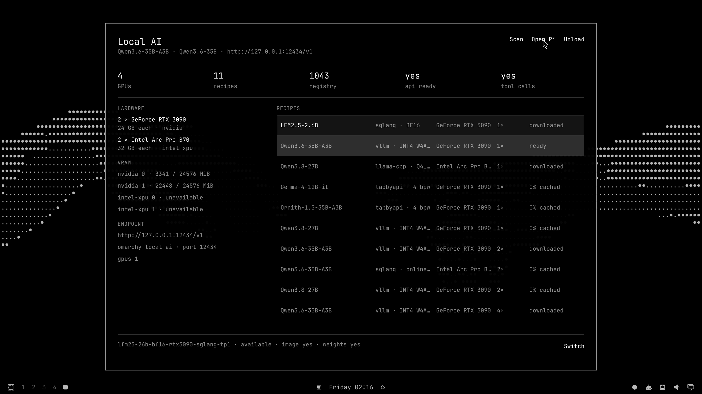

# Omarchy Local AI

Run validated [local-ai-registry](https://github.com/0xSero/local-ai-registry)
models on your local GPUs from the Omarchy bar. One labeled Docker container,
one loopback endpoint, wired straight into Pi / Oh My Pi.



## Install

```bash
omarchy plugin add https://github.com/0xSero/omarchy-local-ai.git --enable
```

That is the whole setup. The plugin adds no packages, services, or build
steps — it uses the Bash, Git, jq, curl, Docker, Hyprland, and Quickshell
already on Omarchy. A vendor GPU driver and Docker GPU runtime are runtime
prerequisites for inference.

Review the diff Omarchy shows before enabling: third-party plugins run as
unsandboxed user code inside the shell.

To remove: `unload` first (stops the managed container and deletes the
`omarchy-local` provider entries it wrote), `remove <recipe>` per downloaded
recipe to reclaim disk, then `omarchy plugin remove sero.local-ai`.

## Use

Bar icon (place with `omarchy bar put sero.local-ai` if you skipped the
prompt): left-click opens the compact popup, right-click opens Pi on the
running model, Enter opens the dashboard. Dashboard: `j`/`k` select, Enter
downloads/runs/switches the selected recipe, `p` opens Pi, Esc closes.

The panel and CLI share one controller:

```bash
~/.config/omarchy/plugins/sero.local-ai/bin/omarchy-local-ai <command>
```

`scan`, `download <recipe>`, `run <recipe>`, `switch <recipe>`, `unload`,
`remove <recipe>` (reclaim disk), `open-agent [pi|omp]`, `default` (make the
running model the default agent model), `snapshot` (the canonical JSON state
the UI renders from).

## Registry

Recipes — hardware + pinned image + pinned model revision + launch arguments —
come from the registry at the exact commit in `registry.pin`, reviewed and
moved with the plugin. Browse it at
[local-ai-registry.vercel.app](https://local-ai-registry.vercel.app/).
Override with `OMARCHY_AI_REGISTRY`, `OMARCHY_AI_REGISTRY_REMOTE`, or
`OMARCHY_AI_REGISTRY_PIN` for private or test registries.

## Safety

- A recipe only launches if it is `validated`, its image is pinned by
  `@sha256` digest, its weights by full commit hash, and every mount resolves
  under the managed cache or the registry checkout. Host networking,
  multi-node launches, and unknown placeholders are refused with a visible
  reason.
- Only containers labeled `io.omarchy.local-ai=1` are ever adopted, started,
  stopped, or removed.
- The OpenAI-compatible endpoint binds to `127.0.0.1` only.
- Ready means accepted: model identity on `/v1/models`, a real chat
  completion, and — for tool recipes — a real `shell` tool call. A failed
  switch rolls back to the previously accepted model.
- Downloads refuse to start when the filesystem cannot fit the weights, and
  the download size is shown before you commit.

## Tests

```bash
./test/all
```

29 isolated cases against a temp registry and shimmed `docker`/`curl`/GPU
tools — no GPU, network, or Docker daemon needed.

## License

MIT
