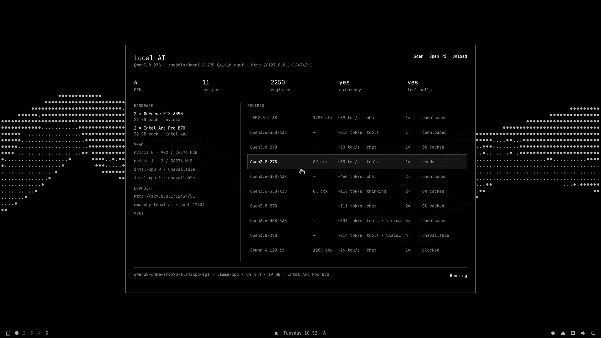

# Omarchy Local AI

One button on the Omarchy bar for local models. The plugin detects your GPUs,
picks the recommended [local-ai-registry](https://github.com/0xSero/local-ai-registry)
recipe for that hardware, and loads it into one labeled Docker container on a
loopback OpenAI endpoint. Click to load, click to unload, click to open your
Omarchy agent on the running model, click to share the endpoint on your
tailnet.



## Install

```bash
omarchy plugin add https://github.com/0xSero/omarchy-local-ai.git --enable
```

That is the whole setup. The plugin adds no packages, services, or build
steps — it uses the Bash, Git, jq, curl, Docker, Hyprland, and Quickshell
already on Omarchy. A vendor GPU driver and Docker GPU runtime are runtime
prerequisites for inference. Nothing downloads without a click: the load
button shows the download size before anything lands on disk.

Review the diff Omarchy shows before enabling: third-party plugins run as
unsandboxed user code inside the shell.

To remove: `unload` first (stops the managed container and deletes the
`omarchy-local` provider entries it wrote), `remove <recipe>` per downloaded
recipe to reclaim disk, then `omarchy plugin remove sero.local-ai`.

## Use

The bar icon is an empty circle until a model is accepted, then filled.
Left-click opens the popup: the recommended model first, up to five runnable
models total, each one click to load or switch. Right-click or "Open agent"
launches your Omarchy default agent — Pi and Oh My Pi get the local model
passed explicitly; other agents launch through `omarchy-agent`. "Share on
Tailscale" publishes the endpoint to your tailnet via `tailscale serve` and
unload always unpublishes it.

The popup and CLI share one controller:

```bash
~/.config/omarchy/plugins/sero.local-ai/bin/omarchy-local-ai <command>
```

`load <recipe>` (download if needed, then run), `unload`, `open-agent
[name]`, `share`, `scan`, `download`, `run`, `switch`, `remove`, `default`
(make the running model the default agent model), `snapshot` (the canonical
JSON state the UI renders from).

## Safety

- Recipes come from the registry at the exact commit in `registry.pin`. A
  recipe only launches if it is `validated`, pins its image by `@sha256`
  digest and its weights by full commit hash, and every mount resolves under
  the managed cache. Host networking, multi-node launches, and unknown
  placeholders are refused with a visible reason.
- Only containers labeled `io.omarchy.local-ai=1` are ever adopted, started,
  stopped, or removed. The endpoint binds to `127.0.0.1` unless you
  explicitly share it on your own tailnet.
- Ready means accepted: model identity, a real chat completion, and a real
  `shell` tool call for tool recipes. A failed switch rolls back to the
  previously accepted model.
- Downloads refuse to start when the filesystem cannot fit the weights.

## Tests

```bash
./test/all
```

34 isolated cases against a temp registry and shimmed `docker`/`curl`/
`tailscale`/GPU tools — no GPU, network, or Docker daemon needed.

## License

MIT
