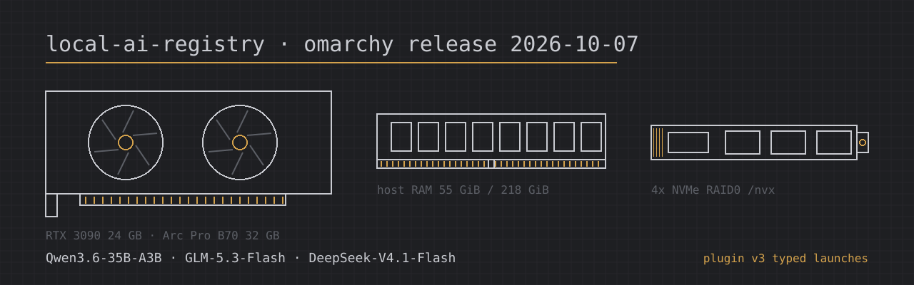

# omarchy release 2026-10-07

These are recipes for the Omarchy Local AI plugin (plugin v3, typed launches) on the omarchy box's cards. One recipe passed lab acceptance. The others are written so they qualify for the plugin export, and need an acceptance run before they ship.

## Supported hardware

| card | VRAM | host RAM / NVMe needs | needs.cpus |
|---|---|---|---|
| RTX 3090 | 24 GB | GLM-5.3-Flash NVMe mode: 55 GiB container cap (`resources`), 242.6 GB of disk with the 117.3 GB expert store on local NVMe (O_DIRECT). All-RAM mode: ~238 GB free RAM, 125.3 GB on NVMe. DeepSeek-V4.1-Flash: 227.8 GB RAM, 425.3 GB on NVMe | 40 (NVMe mode, DeepSeek) |
| Arc Pro B70 | 32 GB | none beyond the card | - |
| 2x Arc Pro B70 | 2x 32 GB | none beyond the cards | - (eligible-only, never run) |
| 3x Arc Pro B70 | 3x 32 GB | - | - (not offered: Qwen3.6's 16 attention heads do not split three ways) |

## Added recipes

| recipe key | model | engine / image | context | status | decode / prefill |
|---|---|---|---|---|---|
| `intel/intel-arc-pro-b70-32gb/qwen3.6-35b-a3b.vllm.256k` | Qwen3.6-35B-A3B GPTQ Int4 + MTP, vision | vLLM XPU / `intel/llm-scaler-vllm@52218ad8` | 262,144 | accepted | 98.9 / 1,609 tok/s |
| `intel/intel-arc-pro-b70-32gb/qwen3.6-35b-a3b.vllm.256k.2x` | Qwen3.6-35B-A3B GPTQ Int4 + MTP, TP=2 | vLLM XPU / `52218ad8` | 262,144 | eligible-only (not run) | not run |
| `nvidia/rtx-3090-24gb/glm-5.3-flash.exllamav3-nvme.128k` | GLM-5.3-Flash EXL3 3.05bpw, 55 GB NVMe mode | ExLlamaV3 / `sybil-solutions/glm53-flash-offload@99b8926e` (v4.1-nvme) | 131,072 | eligible-only (deferred) | README: 14.85 / 583 tok/s |
| `nvidia/rtx-3090-24gb/glm-5.3-flash.exllamav3.128k` | GLM-5.3-Flash EXL3 3.05bpw, all experts in RAM | ExLlamaV3 / `0xsero/glm53-flash-offload@bb633b0b` | 131,072 | blocked (reported proof; acceptance deferred) | reported: 28.9 / 958 tok/s |
| `nvidia/rtx-3090-24gb/deepseek-v4.1-flash.vllm.256k` (typed launch) | DeepSeek-V4.1-Flash EXL3 3.0bpw | vLLM / `0xsero/dsv41-flash-offload@964fb0a1` | 262,144 | eligible-only (awaiting user) | previous proof: 18.5 / 724 tok/s |
| Qwen3.8-Flash-Next on B70 | - | - | - | blocked (no image) | - |
| Gemma 4 26B A4B on B70 | - | - | - | blocked (slot parked) | - |

Launch files are in `registry/launches/`:
- `vllm-qwen3.6-35b-a3b-gptq-int4-mtp-256k-intel-arc-pro-b70-32gb`
- `vllm-qwen3.6-35b-a3b-gptq-int4-mtp-256k-2x-intel-arc-pro-b70-32gb`
- `exllamav3-glm-5.3-flash-exl3-3.05bpw-nvme-55g-128k-rtx-3090-24gb`
- `vllm-deepseek-v4.1-flash-exl3-3.0bpw-offload-256k-rtx-3090-24gb-typed`

None of them uses raw docker flags:
- Memory limits, memlock and IPC_LOCK go through typed `resources`.
- The expert store and the DeepSeek pack are built and checked by typed `prepare` (`pack-store` / `verify-store`, `prepare` / `verify-pack`).
- The B70 launches replace `--ipc host` with `shm`. Their entrypoint links the passed render nodes under `/dev/dri/by-path`, so they need no seccomp or capability flags.

## Measured: Qwen3.6-35B-A3B on one Arc Pro B70 (accepted)

The measurements were taken on 2026-10-07 on omarchy, with the Arc Pro B70 at 0000:84:00.0 and only its render node passed in. The rows come from two runs:
- The 213,570-token row is the lab context and speed gates (`lab.py try --on endpoint`).
- The 8k rows come from a chat sweep. Completions ran to their natural end, with no output cap.

| prefill size | prefill speed | decode speed | concurrency | kv cache | gpu count |
|---|---|---|---|---|---|
| 8,192 | 8,243 tok/s | 105.5 tok/s | 1 | 275,417 tokens (fp8) | 1 |
| 8,192 | 592 tok/s aggregate | 134.0 tok/s aggregate (68.4 / 97.2 per stream) | 2 | 275,417 tokens (fp8) | 1 |
| 8,192 | not run (aborted: PCIe drop) | not run (aborted: PCIe drop) | 4 | 275,417 tokens (fp8) | 1 |
| 32,768 | not run | not run | 1 | 275,417 tokens (fp8) | 1 |
| 32,768 | not run | not run | 2 | 275,417 tokens (fp8) | 1 |
| 213,570 (lab context gate) | 1,609 tok/s | 98.9 tok/s (lab speed gate, first 30 s) | 1 | 275,417 tokens (fp8) | 1 |

## Known issues

- **B70 0000:84:00.0 dropped off the PCIe bus during the Qwen3.6 sweep.** It happened at 16:38:30 CEST in the 8k C4 row, two minutes after all six lab gates had passed.
  - Kernel log: pciehp Slot(17) Link Down / Card not present, then AMD-Vi IOMMU 0000:80:00.2 Completion-Wait loop timed out.
  - The box already had marginal PCIe; both B70s dropped on 2026-10-06 under other jobs.
  - The card is parked until the next reboot. The C4 and 32k rows above were not measured.
- **GLM-5.3-Flash acceptance on the RTX 3090 is deferred.** The card's slot is held by the HOM-272 campaign. Both GLM recipes need `lab.py try --on endpoint` on the RTX 3090 when it frees.
  - The NVMe mode's README decode, 14.85 tok/s at C1 (13.7 in the image smoke test), is below the 15 tok/s speed gate, so it may not pass.
- **DeepSeek-V4.1-Flash needs a re-acceptance on its typed launch.** The user stopped this server, and relaunching it needs the user's go-ahead. Until a new proof is bound to the typed launch, the recipe stays on its old launch (raw flags), which the plugin does not export.
